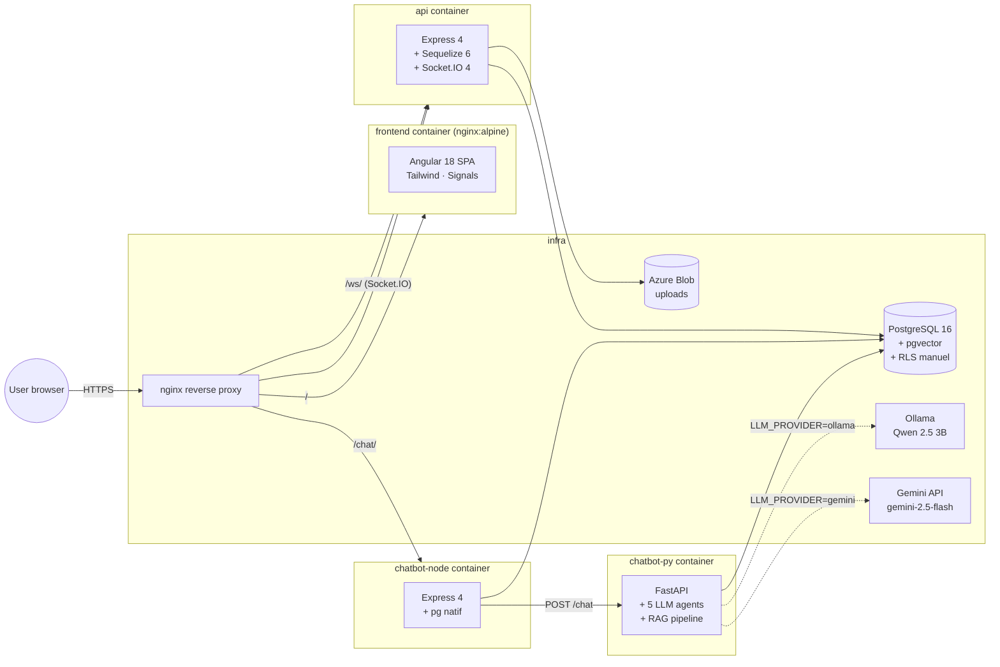
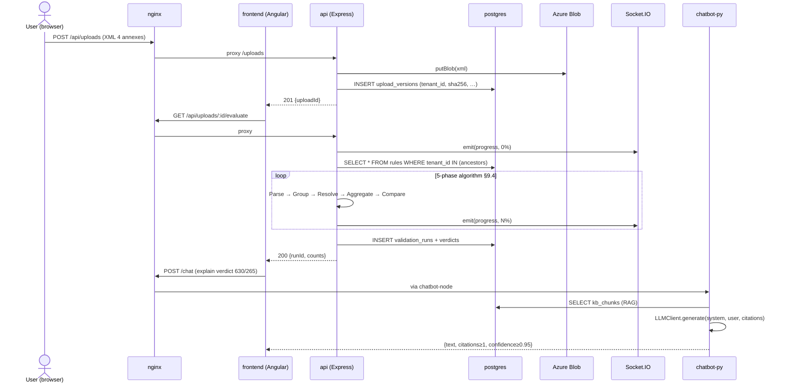
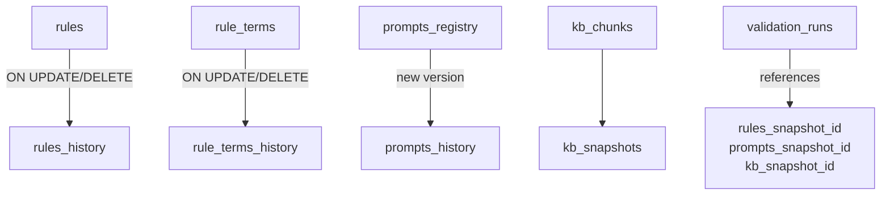

# Architecture — diagram

## Vue d'ensemble des services (Phase 0 bootstrap)

## Ports (dev local)

| Service         | Port host | Port container |
|-----------------|-----------|----------------|
| nginx (reverse) | 80        | 80             |
| frontend        | 4200      | 80 (nginx)     |
| api             | 3000      | 3000           |
| chatbot-node    | 3001      | 3001           |
| chatbot-py      | 8000      | 8000           |
| postgres        | 5432      | 5432           |
| ollama          | 11434     | 11434          |

## Réseau et isolation

- Tous les services partagent le réseau Docker par défaut créé par
  `docker compose` (découverte par nom de service).
- Pas d'exposition publique de `postgres` en prod (seul `nginx:80` est exposé).
- En dev on publie tous les ports pour faciliter le debug direct.

## Flow de requête typique : évaluation d'un rapport

## Immutabilité & versioning (pilier 6)

Toute validation run fige les pointeurs (snapshot IDs) au moment T. Replay à
10 ans = rehydrate les rules/prompts/KB à leurs versions de l'époque, ré-exécute
l'évaluateur, vérifie verdict bit-identique.

## Références
- `docs/architecture/00-master-document.md` §8 (data model), §9 (algorithme)
- `docs/architecture/01-extracted-facts.md` §3, §6, §13
- ADR 0003 — RLS manuel
